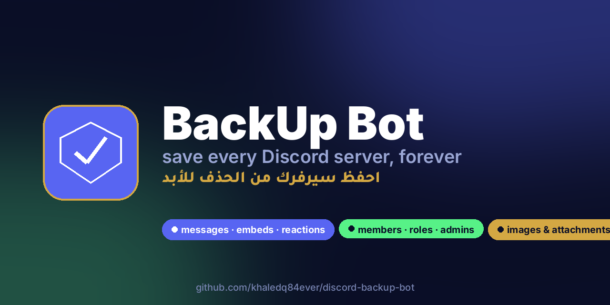
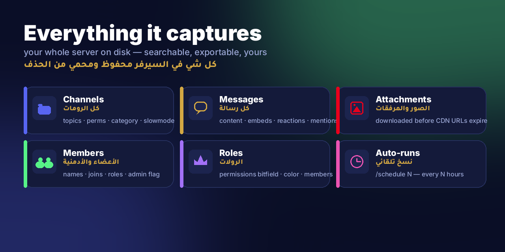
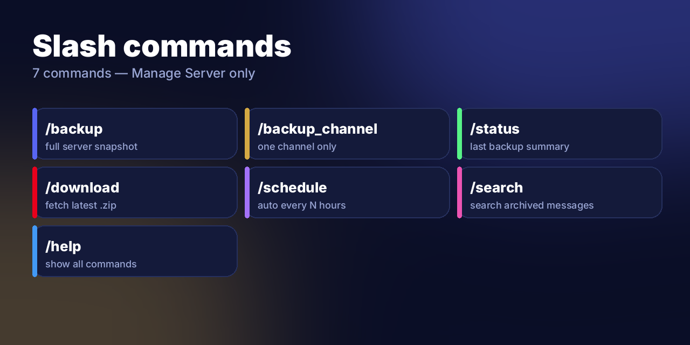
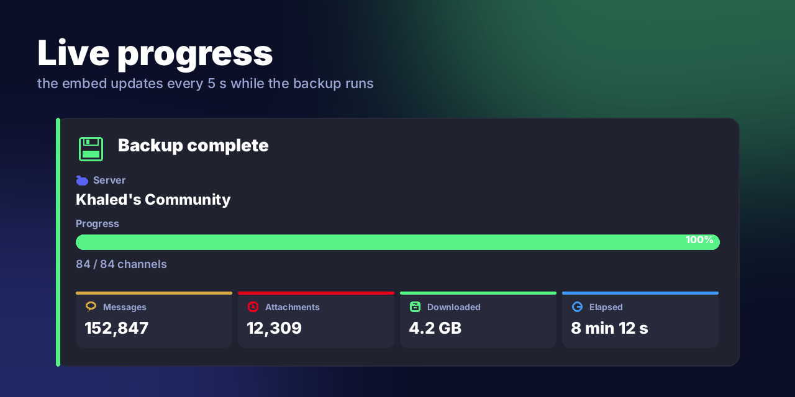
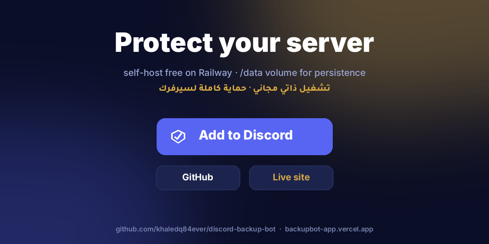

<div align="center">



# 💾 BackUp Bot — for Discord

**Full Discord server archival.** Channels · Roles · Members · Messages · Embeds · Reactions · Attachments · Emojis · Server metadata.

نسخة احتياطية كاملة لسيرفر ديسكورد — كل شي محفوظ للأبد، حماية من الحذف

[](#-self-host)
[](https://backupbot-app.vercel.app)
[](https://github.com/khaledq84ever/discord-backup-bot)
[](https://railway.app)
[](https://www.python.org)

</div>

---

## 🛡️ Why this bot exists

Discord is great until somebody deletes the wrong thing. Channels vanish, members get banned, messages get nuked, attachment links **expire after a few hours**, and admins make mistakes. There's no "undo".

**BackUp Bot fixes that.** Run `/backup` once — or schedule it with `/schedule 24` — and your entire server is captured to disk: every channel, every role with permissions, every member with their join date, every message with embeds and reactions, **and every attachment downloaded locally before Discord's CDN URL expires.**

Your data, your disk, your rules.

---

## 📦 What gets backed up

<div align="center">

</div>

| Category | What's captured |
|---|---|
| **🏠 Server metadata** | Name, icon, banner, owner, features, locale, verification level, AFK settings, vanity URL |
| **📁 Channels** | Every text / voice / thread / forum — topic, position, NSFW flag, slowmode, bitrate, per-role permission overwrites |
| **🎭 Roles** | Permissions bitfield, color, hoist, mentionable, position, role icon, full member list |
| **👥 Members** | Username, global name, nick, avatar URL, join date, role assignments, admin flag, premium-since |
| **💬 Messages** | Full content, embeds (JSON), reactions, mentions, replies, edits, pins, timestamps, message type |
| **📎 Attachments** | **Downloaded to disk** — images, videos, audio, files. URL + size + content-type indexed in SQLite |
| **😀 Emojis** | Every custom emoji with its URL and metadata |

Everything is stored in a **per-guild folder** with a SQLite DB for messages and JSON files for metadata. Trivially queryable, searchable, and restorable from.

---

## ⚡ Slash commands

<div align="center">

</div>

| Command | What it does |
|---|---|
| `/backup` | Run a full backup of this server (incremental — resumes from where the last run left off) |
| `/backup_channel <channel>` | Back up just one channel |
| `/status` | Show last backup time, message count, attachment count, on-disk size |
| `/download` | Send the latest `.zip` snapshot as an ephemeral file (or point at the path if > 25 MB) |
| `/schedule <hours>` | Auto-run `/backup` every N hours (0 disables) |
| `/search <query>` | Search every archived message for a keyword |
| `/help` | Show all commands |

All commands require **Manage Server** to run.

---

## 📊 Live progress

The `/backup` embed updates every 5 seconds while a backup runs — channels done, messages saved, attachments downloaded, bytes pulled, elapsed time:

<div align="center">

</div>

When it finishes you get a 📦 snapshot field with the `.zip` filename and size. Run `/download` to pull it.

---

## 🚀 Self-host

<div align="center">

</div>

### 1. Create a Discord app

→ https://discord.com/developers/applications

- **Bot → Reset Token** → copy the token
- **General Information** → copy the **Application ID**
- **Bot → Privileged Gateway Intents** — enable BOTH:
  - ✅ `SERVER MEMBERS INTENT` (needed to snapshot the member list)
  - ✅ `MESSAGE CONTENT INTENT` (needed to archive message text)

### 2. Configure

```bash
git clone https://github.com/khaledq84ever/discord-backup-bot.git
cd discord-backup-bot
cp .env.example .env
# fill in DISCORD_TOKEN and APPLICATION_ID
```

### 3. Deploy to Railway

```bash
railway init -n discord-backup-bot
railway volume add /data            # persistent backup storage
railway up --detach
```

Or run locally:

```bash
python3 -m venv .venv
source .venv/bin/activate
pip install -r requirements.txt
python3 bot.py
```

---

## 📂 Project layout

```
discord-backup-bot/
├── bot.py            # 7 slash commands
├── backup.py         # scrape channels/messages/roles/members + attachment download
├── storage.py        # SQLite schema + filesystem layout per guild
├── config.py         # env-driven config
├── requirements.txt  # discord.py + aiohttp + python-dotenv
├── Dockerfile        # Python 3.12-slim
├── railway.json      # worker service config
├── web/              # Arabic-first landing page (white bg, black bold)
│   ├── index.html
│   ├── Dockerfile
│   └── railway.json
├── assets/
│   ├── fonts/        # Inter + Tajawal (Arabic shaping via libraqm)
│   ├── make_promo.py # 5 vector-drawn README images
│   └── promo/        # generated PNGs (01-hero … 05-cta)
└── data/             # gitignored, mounted /data on Railway
    └── <guild_id>/
        ├── guild.json
        ├── channels.json
        ├── roles.json
        ├── members.json
        ├── emojis.json
        ├── backup.db          # SQLite with every message
        ├── attachments/       # downloaded files
        ├── backups/           # .zip snapshots
        └── last_backup.json
```

---

## 🧱 Storage schema

**`messages`** (one row per message)
```sql
id, channel_id, channel_name, author_id, author_name, content,
created_at, edited_at, reply_to, pinned, type,
embeds_json, reactions_json, mentions_json
```

**`attachments`** (one row per file)
```sql
id, message_id, channel_id, filename, url, size, local_path, content_type
```

**`backup_runs`** (one row per `/backup` invocation)
```sql
id, started_at, ended_at, channels, messages, attachments, bytes, error
```

Query with `sqlite3 data/<guild_id>/backup.db` or build a viewer.

---

## ⚠️ Notes &amp; limits

- **Discord rate limits** apply to message history scraping. A large channel takes minutes, not seconds. The scrape is async, fully resumable, and writes in batches of 200 so progress survives restarts.
- **Attachment expiry.** Discord CDN URLs now contain signed expiries. BackUp Bot downloads files **immediately** during the scrape, before they go stale. Re-running `/backup` will fetch any new attachments since last run.
- **Bot needs read access** to every channel you want backed up. Make sure its role has `View Channel` + `Read Message History` everywhere.
- **No restoration** — yet. The export format is rich enough to restore from (e.g. via webhooks) but Discord doesn't let bots recreate users or message authorship, so a real restore is approximate. The data is yours; do what you want with it.
- **Disk space.** Mount `/data` to a Railway volume (or any persistent storage) — large servers can produce gigabytes once attachments are downloaded.

---

## 📜 License

MIT — do whatever you want.

---

<div align="center">

**One of three bots in the family** — [AI chat](https://github.com/khaledq84ever/discord-ai-bot) · [Music player](https://github.com/khaledq84ever/discord-music-bot) · BackUp Bot

[Live site](https://backupbot-app.vercel.app) · [@KhaledQ84Ever](https://x.com/KhaledQ84Ever)

</div>
