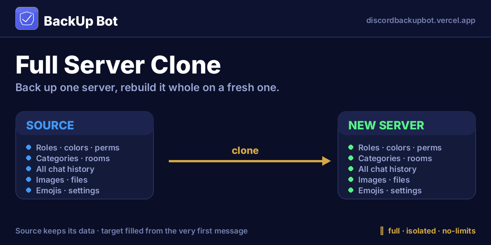
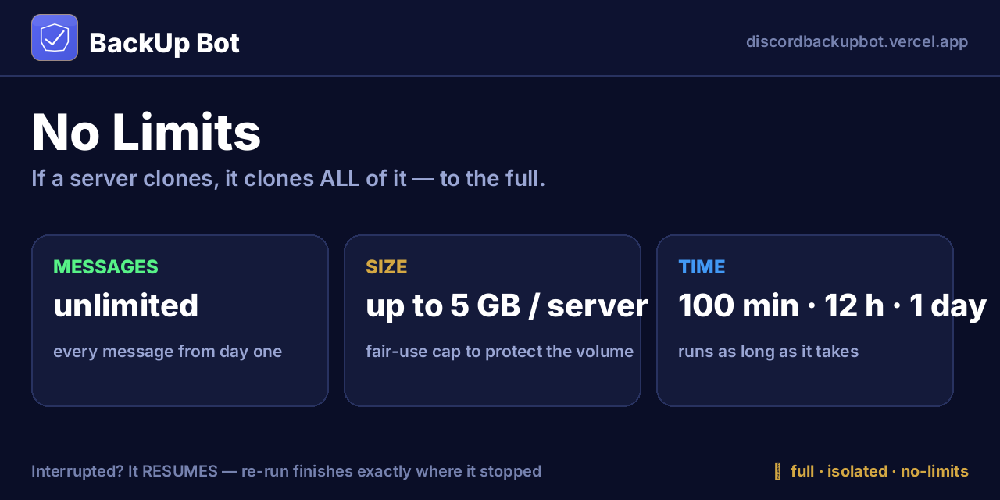
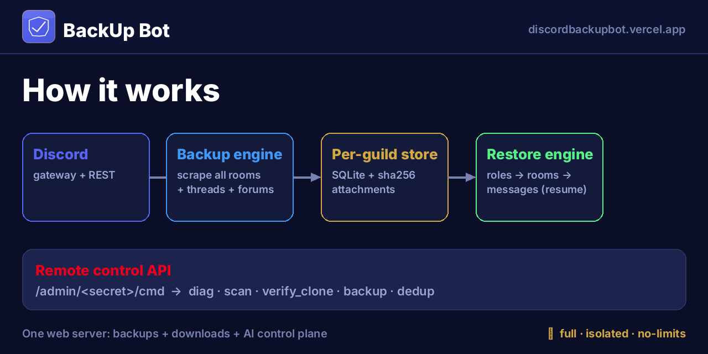
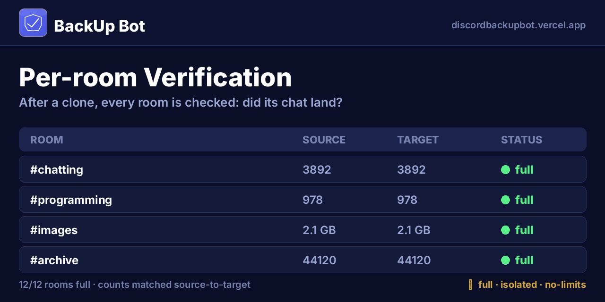
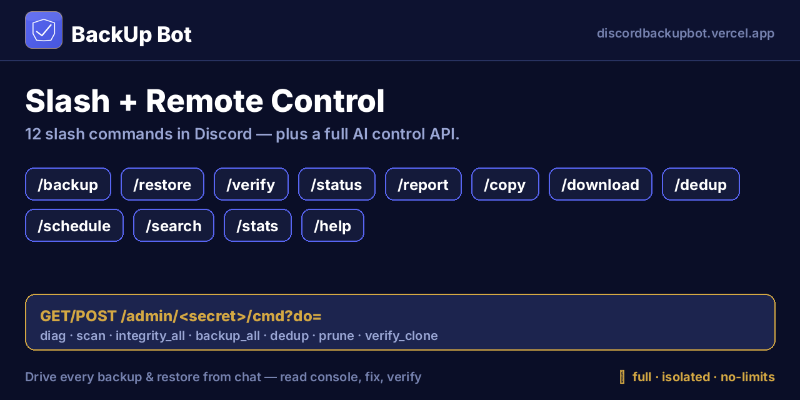

# 🛡️ BackUp Bot

### Full Discord server backup &amp; **server-to-server clone** — no limits.
### نسخ احتياطي كامل لسيرفرات ديسكورد ونسخ سيرفر إلى سيرفر — بدون حدود.

---

## 💡 What it does · ماذا يفعل

**EN** — BackUp Bot archives an **entire** Discord server — every message from day one, all channels, threads &amp; forums, roles, members, emojis, server settings, and every image/file — into a private per-server vault. Then it can **rebuild that server whole onto a fresh one**: roles → categories → rooms → permissions → messages (with the original author's name &amp; avatar).

**ع** — بوت BackUp يحفظ سيرفرك **بالكامل** — كل رسالة من أول يوم، كل الرومات والثريدات والفورَم، الرولات، الأعضاء، الإيموجي، إعدادات السيرفر، وكل صورة وملف — في خزنة خاصة لكل سيرفر. وبعدها يقدر **ينسخ السيرفر كامل على سيرفر جديد**: الرولات ← التصنيفات ← الرومات ← الصلاحيات ← الرسائل (باسم وصورة صاحب الرسالة الأصلي).

> 🔁 سيرفرك الأصلي يبقى فيه كل بياناته · سيرفرك الجديد ينتعبّى من أول رسالة.
> *Your source server keeps all its data; the new one is filled from the very first message.*

---

## ♾️ No limits · بدون حدود

| EN | ع | |
|---|---|---|
| **Messages** — unlimited, from day one | **الرسائل** — بلا حد، من أول يوم | ♾️ |
| **Time** — hours/days, **resumes if interrupted** | **الوقت** — ساعات/أيام، **يكمل لو انقطع** | ⏱️ |
| **Size** — up to **5 GB per server** | **الحجم** — لين **5 جيجا للسيرفر** | 💾 |
| **Files** — images &amp; files up to Discord's max | **الملفات** — صور وملفات لأقصى حد بديسكورد | 🖼️ |

**EN** — If a restore is interrupted, just run it again — it counts what already landed and **continues from the exact cut-off**, never duplicating.
**ع** — لو توقّف الاسترجاع، شغّله مرة ثانية — يحسب اللي انحفظ و**يكمّل من نفس النقطة** بدون تكرار.

---

## 🧩 How it works · كيف يشتغل

- **Backup engine / محرّك النسخ** — text/voice/news + active &amp; archived threads + forum posts; downloads attachments before the CDN expires; off-loop DB writes so the gateway never freezes. / يسحب كل أنواع الرومات والثريدات والفورَم، وينزّل المرفقات قبل ما تنتهي روابطها، وبدون تجميد.
- **Per-server store / تخزين لكل سيرفر** — `DATA_DIR/<guild_id>/` — own DB, attachments, zips; identical files stored once (sha256). / لكل سيرفر مجلده الخاص، والملفات المتطابقة تُخزّن مرة وحدة.
- **Restore engine / محرّك الاسترجاع** — rebuilds in order, replays via webhooks, **resumes** partial channels, idempotent. / يعيد البناء بالترتيب، ويكمل الرومات الناقصة، وما يكرّر.
- **Remote control API** — drive backups/restores &amp; read the console from outside Discord.

---

## ✅ Per-room verification · تحقّق لكل روم

**EN** — After a clone, `verify_clone` compares source vs target **room-by-room** — every channel reported `full` / `partial` / `missing` with message counts.
**ع** — بعد النسخ، أداة `verify_clone` تقارن المصدر بالهدف **روم روم** — كل روم تطلع `كامل` / `ناقص` / `مفقود` مع عدد الرسائل.

---

## ⌨️ Commands · الأوامر

| Command | EN | ع |
|---|---|---|
| `/backup` | Full server backup | نسخة كاملة للسيرفر |
| `/download` | Private download link | رابط تحميل خاص |
| `/restore` | Restore/clone — **link or uploaded `.zip`** | استرجاع/نسخ — **رابط أو ملف** |
| `/status` · `/stats` | Backup status &amp; storage | حالة النسخة والتخزين |
| `/search` | Search saved messages | بحث بالرسائل المحفوظة |
| `/schedule` | Automatic backups | نسخ تلقائي |
| `/dedup` | Reclaim duplicate disk | تنظيف الملفات المكررة |
| `/report` · `/copy` · `/help` | Copy-friendly status &amp; commands | نسخ الحالة والأوامر |

---

## 🔒 Privacy &amp; isolation · الخصوصية والعزل

**EN** — Every server is a **sealed vault**: files live under that server's own folder, dedup runs *within* a server only, and each download link is an HMAC token bound to that server's ID — one link **cannot** be tampered/guessed to reach another server's backup.

**ع** — كل سيرفر **خزنة مقفلة**: ملفاته في مجلده الخاص، والتنظيف يصير داخل السيرفر نفسه فقط، وكل رابط تحميل مربوط بـID السيرفر — ما يمكن تعديله أو تخمينه للوصول لنسخة سيرفر ثاني.

## 🧹 Automatic storage hygiene · تنظيف تلقائي للتخزين

- **3-day retention** — old zips auto-deleted / النسخ القديمة تُحذف بعد ٣ أيام
- **Keep newest only** — one zip per server / نسخة وحدة لكل سيرفر
- **Daily dedup** — duplicate bytes collapsed / دمج الملفات المكررة يومياً

---

🌐 **[discordbackupbot.vercel.app](https://discordbackupbot.vercel.app)** · 💻 Programmed by **[@KhaledQ84Ever](https://x.com/KhaledQ84Ever)**

**[github.com/khaledq84ever/discord-backup-bot](https://github.com/khaledq84ever/discord-backup-bot)**

